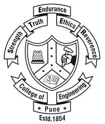

## **Educational Background**

 
   1) Master of science - Industrial Engineering with specialization in Operations Research 
from University at Buffalo 2020 (GPA 3.8) 
 

 
  
  2) Bachelor of Technology - Instrumentation and Control Engineering 
from College of Engineeering Pune  
 

 
 <h1 style="background-color:powderblue;">This is a heading</h1> 
 Work Experience 

Petrofac 
 

